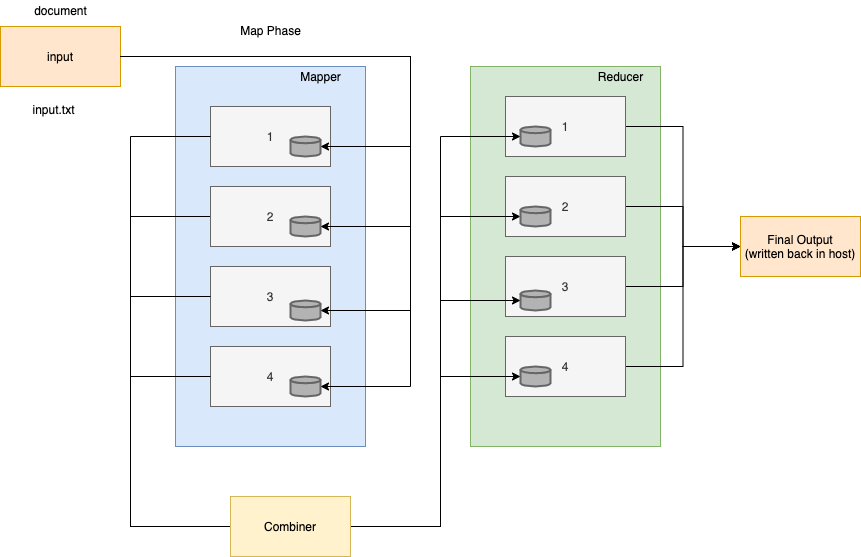

# Credit 

This is a forked/debugged version of https://github.com/sanjitk7/MapReducePython

# A Distributed MapReduce Algorithmic Simulation with Docker Nodes

This project aims to simulate the working of the MapReduce algorithm in a distributed system with docker - multiple containers act as processes/nodes running in parallel. 

A simple example of finding out the frequency of all words in a large text file is taken. Although this looks like a simple problem, for a sufficiently large enough file the computation is costly if done in serial.

## Example

**The text files are named as follows (n being total chunks):**
1. On Initial Chunking: split_i_n
2. Map Phase output: mapped_i_n
3. Combine Phase output: combined_split_i_n
4. Reduce Phase output: reduced_i_n

## Dependencies
1. Python 3.x
2. Bash or zsh Shell
3. Docker
4. Ruby

## How to run

From your unix terminal:

* Add yourself to the docker group:  
**$** sudo usermod -aG docker <your_username>

* Logout and login again.

* Go to demo-mapreduce/2-docker/

The docker images are available on the dhub.ox server so you just need to pull them:  
**$** ./pullimgs.sh

To run the program:  
**$** ./mapreduce.sh \<input-file\>

For the sake of this demo, use:  
**$** ./mapreduce.sh ../input-text/a-tale-of-two-cities.txt

It produces as a result: ../results/mapreduce_docker_results.txt
