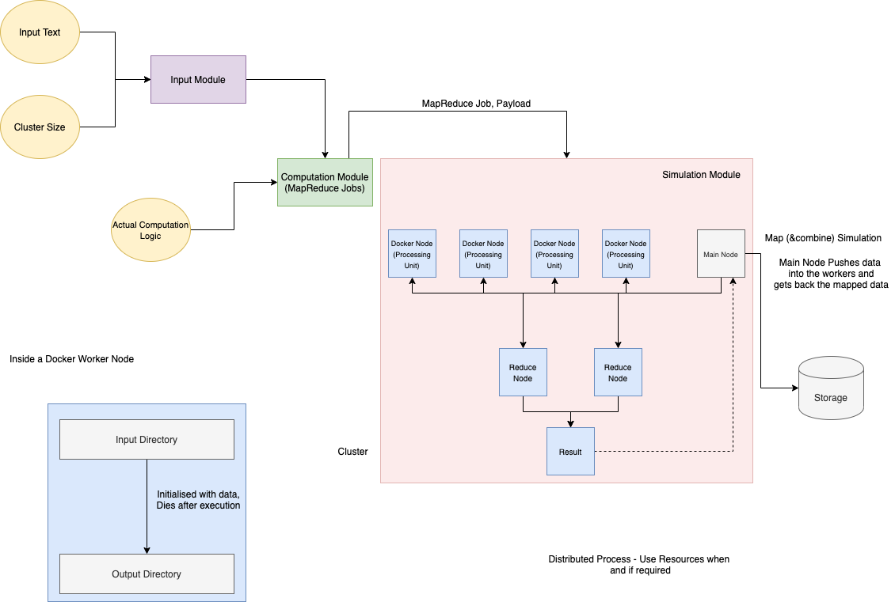

# Credit where credit is due

This is a forked/debugged version of https://github.com/sanjitk7/MapReducePython

# A Distributed MapReduce Algorithmic Simulation with Docker Nodes

This project aims to simulate the working of the MapReduce algorithm in a distributed system with the docker - multiple containers act as processes/nodes running in parallel. 

A simple example of finding out the frequency of all words in a large text file is taken. Although this looks like a simple problem, for a sufficiently large enough file the computation is costly if done in serial.

## Example

**The text files are named as follows (n being total chunks):**
1. On Initial Chunking: split_i_n
2. Map Phase output: mapped_i_n
3. Combine Phase output: combined_split_i_n
4. Reduce Phase output: reduced_i_n

## How to run

### Dependencies
1. Python 3.x
2. Bash or zsh Shell
3. Docker
4. Ruby

###

From your unix terminal:

Clone the repository and go to the project's root directory 

Create the docker images: ./mkimgs.sh

Run the program: ./mapreduce.sh <input-file>
It produces as a result: mapreduce_docker_results.txt
