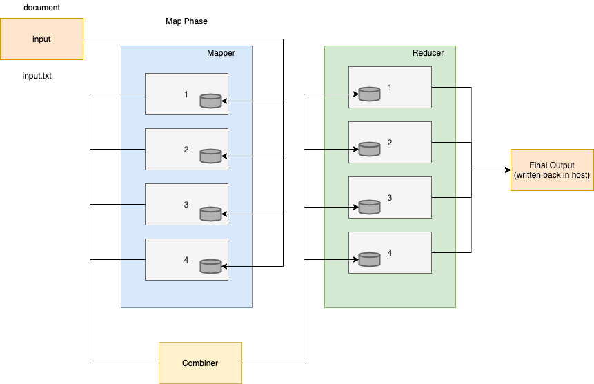

# Credit where credit is due

This is a forked/debugged version of https://github.com/sanjitk7/MapReducePython

# A Distributed MapReduce Algorithmic Simulation with Docker Nodes

This project aims to simulate the working of the MapReduce algorithm in a distributed system with the docker - multiple containers act as processes/nodes running in parallel. 

A simple example of finding out the frequency of all words in a large text file is taken. Although this looks like a simple problem, for a sufficiently large enough file the computation is costly if done in serial.

## What is MapReduce?

The MapReduce Algorithm is a computational model for parallel and distributed computing used in big data and cloud computing on a cluster. The idea is to use multiple machines in the distributed system that all contain portions of the data that has to go though a certain computation. For this purpose the MapReduce algorithm has 2 major phases - The Map Phase and The Reduce Phase.

### Map Phase

Map Function is the first step in MapReduce Algorithm. Map phase will work on key & value pairs input. It takes input tasks and divides them into smaller sub-tasks and then perform required computation on each sub-task in parallel. Mapper output will be displayed in the form of (K,V) pairs. Map phase performs the following two sub-steps -
1. **Splitting** - Takes input dataset from Source and divide into smaller sub-datasets.
2. **Mapping** - Takes the smaller sub-datasets as an input and perform required action or computation on each sub-dataset.
The output of the Map Function is a set of key and value pairs as <Key, Value>.

### Combine Phase

There is a hidden intermediate combine phase which gets all the Map function's output as input to sort & shuffle. The shuffling is the grouping of the data from various nodes based on the key. This is a logical phase. Sort is used to list the shuffled inputs in sorted order.

### Reduce Phase

Reduce phase is the final step in MapReduce Algorithm. This is where the business logic or the core computation step lies. This happens in parallel or serial depending on the multiplicity of tasks.

## Example

**The text files are named as follows (n being total chunks):**
1. On Initial Chunking: split_i_n
2. Map Phase output: mapped_i_n
3. Combine Phase output: combined_split_i_n
4. Reduce Phase output: reduced_i_n

## How to run

### Dependencies
1. Python 3.x
2. Bash or zsh Shell
3. Docker
4. Ruby

###

From your unix terminal:

Clone the repository and go to the project's root directory 

Create the docker images: ./mkimgs.sh

Run the program: ./run_parallel.sh

It takes as input text: data/a-tale-of-two-cities.txt 

And produces as a result: data/final/final_text_freq.txt
